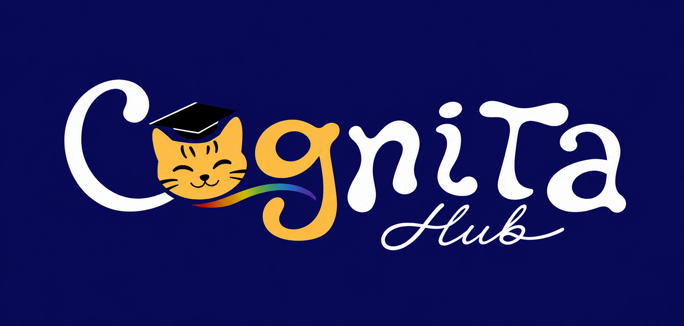

<div align="center">
  
</div>

<br />

<h1 align="center">Cognita Hub</h1>

<p align="center">
  <strong>A matemática ao alcance de cada mente.</strong>
</p>

<p align="center">
  Plataforma educacional de conexão entre crianças com TEA, responsáveis e tutores voluntários para apoio no desenvolvimento de habilidades matemáticas.
</p>

<table align="center">
  <tr>
    <td align="center" width="170">
      <a href="#sobre-o-projeto">
        <strong>Sobre</strong><br />
        <sub>Visão geral</sub>
      </a>
    </td>
    <td align="center" width="170">
      <a href="#problema">
        <strong>Problema</strong><br />
        <sub>Contexto</sub>
      </a>
    </td>
    <td align="center" width="170">
      <a href="#solução">
        <strong>Solução</strong><br />
        <sub>Proposta</sub>
      </a>
    </td>
  </tr>
  <tr>
    <td align="center" width="170">
      <a href="#público-alvo">
        <strong>Público-alvo</strong><br />
        <sub>Para quem</sub>
      </a>
    </td>
    <td align="center" width="170">
      <a href="#tecnologias">
        <strong>Tecnologias</strong><br />
        <sub>Stack</sub>
      </a>
    </td>
    <td align="center" width="170">
      <a href="#status-do-projeto">
        <strong>Status</strong><br />
        <sub>Andamento</sub>
      </a>
    </td>
  </tr>
</table>

---

## Sobre o projeto

O **Cognita Hub** é uma proposta de plataforma educacional voltada à inclusão de crianças com **TEA — Transtorno do Espectro Autista** no processo de aprendizagem matemática.

O projeto nasce dentro do contexto de **Inclusão e Direitos Humanos**, reconhecendo a neurodiversidade como uma variação natural do funcionamento humano e defendendo que estudantes neurodivergentes devem ter acesso a recursos, métodos e apoios educacionais adequados às suas necessidades.

A plataforma tem como objetivo funcionar como um **hub de conexão** entre:

* crianças com TEA que apresentam dificuldades em Matemática;
* responsáveis legais;
* tutores voluntários com formação ou experiência em aprendizagem inclusiva;
* iniciativas e instituições ligadas à educação inclusiva.

Mais do que uma plataforma de estudos tradicional, o Cognita Hub busca criar uma ponte entre quem precisa de apoio e quem pode oferecer acompanhamento educacional de forma voluntária, organizada e acessível.

---

## Significado do nome

O nome **Cognita Hub** une dois conceitos centrais do projeto:

### Cognita

“Cognita” se relaciona à ideia de conhecimento e cognição. A palavra remete à capacidade de processar informações, aprender, compreender e construir saberes.

### Hub

“Hub” representa um ponto de conexão. No projeto, simboliza a função da plataforma como ponte entre crianças, famílias, tutores voluntários e oportunidades educacionais.


---

## Slogans trabalhados

Algumas frases que representam a proposta do projeto:

* **A matemática ao alcance de cada mente.**
* **Diferentes mentes, uma só matemática.**
* **Flexível no caminho, firme na matemática.**
* **Conectando mentes ao ensino da matemática.**

---

## Problema

A aprendizagem matemática é uma habilidade essencial no desenvolvimento educacional, social e cotidiano de qualquer estudante. No entanto, para muitas crianças com TEA, o ensino tradicional pode apresentar barreiras significativas.

Essas dificuldades podem estar relacionadas a:

* assimilação de conceitos abstratos;
* organização espacial e temporal;
* comunicação e interação social;
* rigidez na forma de apresentação dos conteúdos;
* ausência de recursos educacionais adaptados;
* práticas pedagógicas pouco inclusivas;
* ideias capacitistas sobre a aprendizagem de estudantes com deficiência.

Além disso, a Matemática costuma ser uma disciplina temida por muitos estudantes e o cenário brasileiro de aprendizagem matemática apresenta déficits importantes ao longo da educação básica.

---

## Justificativa

A inclusão escolar não se efetiva apenas com a presença do estudante na escola. Para que a aprendizagem aconteça de forma real, é necessário oferecer suporte, adaptação metodológica, recursos acessíveis e acompanhamento adequado.

No caso da Matemática, essa necessidade se torna ainda mais evidente, já que a disciplina possui caráter abstrato, sequencial e acumulativo. Quando o estudante não compreende conceitos iniciais, dificuldades posteriores podem se intensificar.

O Cognita Hub surge como uma proposta de apoio educacional para reduzir barreiras, fortalecer a aprendizagem e ampliar o acesso de crianças com TEA a experiências matemáticas mais acessíveis, humanas e organizadas.

---

## Público-alvo

O projeto tem como público-alvo inicial:

* crianças com TEA;
* com idade entre **5 e 9 anos**;
* regularmente matriculadas em escolas públicas;
* estudantes da educação infantil e do ensino fundamental I;
* crianças que apresentem dificuldades de aprendizagem em Matemática.

A identificação da dificuldade pode ocorrer por meio de baixo rendimento acadêmico, boletim escolar ou relatório pedagógico elaborado pela escola.

---

## Solução

O Cognita Hub propõe a construção de um site que funcione como uma plataforma de conexão entre crianças com TEA e tutores voluntários.

A solução será organizada em três frentes principais:

### 1. Cadastro da criança

A criança será cadastrada por uma pessoa maior de idade, como pai, mãe ou responsável legal. O cadastro poderá reunir informações educacionais importantes para compreender as dificuldades de aprendizagem matemática e as necessidades de apoio.

### 2. Cadastro de tutores voluntários

Profissionais do ensino de Matemática, pedagogia, psicopedagogia ou áreas relacionadas poderão se cadastrar como tutores voluntários.

Esses tutores disponibilizarão, inicialmente, **1 hora semanal** para acompanhamento educacional da criança.

### 3. Acompanhamento de 6 meses

Cada criança poderá participar de um ciclo de acompanhamento com duração de **6 meses**, com foco no desenvolvimento de habilidades matemáticas adequadas à faixa etária.

Durante esse período, o tutor poderá registrar atividades, observações, progresso e próximos passos.

---

## Funcionamento previsto

O fluxo principal da plataforma será:

1. O responsável cadastra a criança.
2. O tutor voluntário realiza o cadastro.
3. A equipe Cognita analisa os dados do tutor.
4. A equipe realiza o match entre criança e tutor.
5. O ciclo de acompanhamento é iniciado.
6. O tutor acompanha a criança por 1 hora semanal.
7. O progresso é registrado na plataforma.
8. Ao final de 6 meses, o ciclo é encerrado ou reorganizado.

---

## Funcionalidades planejadas

### Site público

* Página inicial de apresentação do projeto.
* Explicação sobre o problema e a solução.
* Área para responsáveis.
* Área para tutores voluntários.
* Seção sobre segurança e responsabilidade.
* Divulgação de iniciativas e notícias sobre Matemática e TEA.

### Área do responsável

* Cadastro da criança.
* Visualização do acompanhamento.
* Informações sobre o tutor.
* Atividades e registros educacionais.
* Progresso do ciclo.

### Área do tutor voluntário

* Cadastro profissional.
* Perfil de atuação.
* Disponibilidade semanal.
* Registro de sessões.
* Registro de atividades.
* Observações sobre o desenvolvimento da criança.

### Área administrativa

* Análise de cadastros.
* Validação de tutores.
* Organização dos matches.
* Controle dos ciclos de acompanhamento.
* Acompanhamento geral da operação.

---

## Identidade visual

A logo do projeto utiliza a imagem de um **gato-maracajá** (*Leopardus wiedii*), também conhecido como gato-do-mato-pequeno.

A escolha do gato-maracajá representa flexibilidade, singularidade e adaptação. Esse animal possui comportamentos diferentes de outros felídeos, como o hábito de se deslocar pelas árvores e a capacidade de girar os tornozelos traseiros em até 180 graus para descer de cabeça para baixo.

Essa característica dialoga diretamente com a proposta do Cognita Hub: reconhecer diferentes formas de aprender, adaptar caminhos e valorizar a diversidade.

As cores da identidade visual fazem referência simbólica à neurodiversidade e buscam transmitir acolhimento, confiança e criatividade.

---

## Paleta de cores

| Cor             | Hexadecimal | Uso                                        |
| --------------- | ----------- | ------------------------------------------ |
| Azul principal  | `#141162`   | Confiança, tecnologia e base institucional |
| Amarelo/dourado | `#FFA800`   | Destaques, energia e identidade do mascote |
| Roxo/vinho      | `#540042`   | Profundidade, contraste e apoio visual     |
| Escuro          | `#230220`   | Textos fortes e elementos de destaque      |
| Branco quente   | `#FFFFFC`   | Fundo principal e sensação de acolhimento  |

---

## Acessibilidade e experiência

O Cognita Hub busca seguir princípios de acessibilidade cognitiva, especialmente importantes para crianças com TEA.

Diretrizes consideradas no desenvolvimento:

* interface visual previsível;
* linguagem simples e objetiva;
* poucos elementos por tela;
* botões grandes e claros;
* ícones acompanhados de texto;
* redução de estímulos visuais excessivos;
* modo foco;
* navegação consistente;
* organização por rotina e progresso;
* uso de cores com contraste adequado.

---

## Relação com os ODS

O projeto se conecta principalmente a dois Objetivos de Desenvolvimento Sustentável:

### ODS 4 — Educação de qualidade

Ao propor apoio educacional em Matemática para crianças com TEA, o projeto contribui para uma educação mais inclusiva, equitativa e acessível.

### ODS 10 — Redução das desigualdades

Ao conectar crianças neurodivergentes a tutores voluntários, o Cognita Hub busca reduzir barreiras de acesso ao apoio educacional especializado.

---

## Divulgação e acesso ao projeto

A divulgação inicial do Cognita Hub está prevista por meio de:

* criação de uma rede social própria, especialmente no Instagram;
* apresentação do projeto a instituições de Belém/PA;
* diálogo com organizações voltadas à inclusão e ao atendimento de pessoas com deficiência.

Instituições inicialmente consideradas:

* **APAE Belém** — Associação de Pais e Amigos dos Excepcionais;
* **CIIR/CETEA** — Centro Integrado de Inclusão e Reabilitação / Centro Especializado em Transtorno do Espectro Autista.

---

## Tecnologias

O protótipo inicial está sendo desenvolvido com tecnologias web básicas:

* HTML5;
* CSS3;
* JavaScript;
* assets próprios de identidade visual;
* estrutura estática de páginas.

Futuramente, o projeto poderá evoluir para uma versão com:

* autenticação de usuários;
* banco de dados;
* painel administrativo funcional;
* armazenamento de registros;
* sistema real de acompanhamento;
* Uso de IA adaptativa; 
* integração com serviços externos.

---

## Estrutura do projeto

```txt
CognitaHub/
├── assets/
│   ├── logo.jpeg
│   ├── logo-icon-transparent.png
│   ├── logo-wordmark-light.png
│   ├── mascot-head.png
│   └── mascot-wave.png
│
├── css/
│   └── styles.css
│
├── js/
│   └── app.js
│
├── pages/
│   ├── login.html
│   ├── cadastro.html
│   ├── responsavel.html
│   ├── profissional.html
│   ├── admin.html
│   └── atividades.html
│
└── index.html
```

---

## Como executar localmente

Clone o repositório:

```bash
git clone https://github.com/markussdev/CognitaHub.git
```

Entre na pasta do projeto:

```bash
cd CognitaHub
```

Abra o arquivo `index.html` no navegador.

Também é possível usar a extensão **Live Server** no VS Code para executar o projeto com recarregamento automático.

---

## Status do projeto

O Cognita Hub está em fase inicial de desenvolvimento.

Atualmente, o projeto possui:

* protótipo visual do site público;
* telas iniciais de dashboard;
* estrutura de páginas;
* identidade visual em construção;
* assets próprios do mascote;
* proposta de fluxo de cadastro e acompanhamento.

---

## Próximos passos

* Refinar o layout da página inicial.
* Melhorar a aplicação da identidade visual.
* Finalizar telas de cadastro.
* Criar fluxo simulado de tutor e responsável.
* Melhorar dashboard do responsável.
* Melhorar dashboard do tutor voluntário.
* Criar painel administrativo mais completo.
* Planejar persistência de dados.
* Definir modelo de banco de dados.
* Implementar autenticação futuramente.
* Validar o projeto com professores, responsáveis e instituições.

---

## Aviso importante

O Cognita Hub é uma proposta de apoio educacional.

A plataforma não substitui acompanhamento clínico, psicológico, terapêutico, médico ou diagnóstico profissional. O objetivo é oferecer uma ponte de apoio pedagógico para o desenvolvimento de habilidades matemáticas de crianças com TEA.

---

## Equipe

Projeto desenvolvido pela equipe **C-FORCE** para o **Desafio Jovem — 4ª edição**.

Belém/Pará — 2026

---
