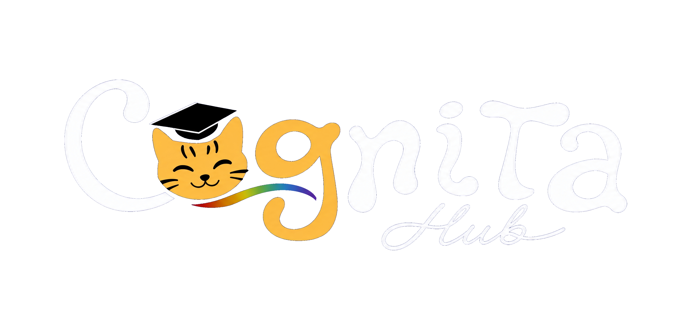
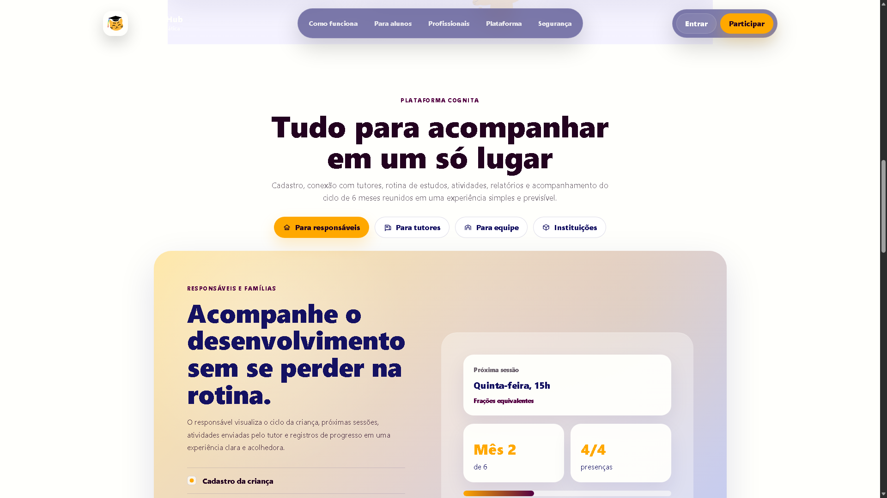
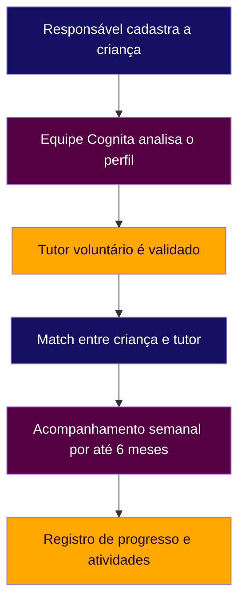

<p align="center">
  
</p>

<h1 align="center">Cognita Hub</h1>

<p align="center">
  <strong>A matemática ao alcance de cada mente.</strong>
</p>

<p align="center">
  Plataforma educacional inclusiva que conecta crianças com TEA, responsáveis e tutores voluntários
  para apoiar o desenvolvimento de habilidades matemáticas.
</p>

<p align="center">
  
  
  
</p>

<p align="center">
  <a href="#previa-do-projeto">Prévia</a> &bull;
  <a href="#sobre-o-projeto">Sobre</a> &bull;
  <a href="#problema">Problema</a> &bull;
  <a href="#solucao">Solução</a> &bull;
  <a href="#como-funciona">Como funciona</a> &bull;
  <a href="#funcionalidades">Funcionalidades</a> &bull;
  <a href="#tecnologias">Tecnologias</a> &bull;
  <a href="#status-do-projeto">Status</a>
</p>

---

## Visão geral

<table>
  <tr>
    <td width="33%">
      <h3>Para quem?</h3>
      <p>Crianças com TEA entre 5 e 9 anos com dificuldades em Matemática.</p>
    </td>
    <td width="33%">
      <h3>O que faz?</h3>
      <p>Conecta responsáveis e tutores voluntários em ciclos de acompanhamento.</p>
    </td>
    <td width="33%">
      <h3>Objetivo</h3>
      <p>Tornar a aprendizagem matemática mais acessível, humana e adaptada.</p>
    </td>
  </tr>
</table>

---

## Prévia do projeto

<p align="center">
  
</p>

<p align="center">
  <em>Interface inicial do Cognita Hub com foco em acolhimento, clareza visual e acessibilidade cognitiva.</em>
</p>

---

## Sobre o projeto

O **Cognita Hub** é uma proposta de plataforma educacional voltada à inclusão de crianças com **TEA - Transtorno do Espectro Autista** no processo de aprendizagem matemática.

A ideia nasce no contexto de **Inclusão e Direitos Humanos**, reconhecendo a neurodiversidade e defendendo que estudantes neurodivergentes tenham acesso a recursos, métodos e apoios educacionais adequados às suas necessidades.

Mais do que uma plataforma de estudos tradicional, o Cognita Hub busca criar uma ponte organizada entre quem precisa de apoio e quem pode oferecer acompanhamento educacional voluntário.

## Problema

A Matemática é uma habilidade essencial para o desenvolvimento educacional, social e cotidiano. Para muitas crianças com TEA, porém, o ensino tradicional pode trazer barreiras importantes.

Essas barreiras podem envolver conceitos abstratos, organização espacial e temporal, comunicação, interação social, rigidez na apresentação dos conteúdos, falta de recursos adaptados e práticas pedagógicas pouco inclusivas.

<a id="solucao"></a>

## Solução

O Cognita Hub propõe um site que conecta crianças com TEA a tutores voluntários com formação ou experiência em aprendizagem inclusiva.

Cada criança é cadastrada por uma pessoa responsável. A equipe Cognita analisa os perfis, valida tutores e organiza os matches para ciclos de acompanhamento de até **6 meses**, com encontros semanais e registro de progresso.

## Como funciona



---

## Funcionalidades

| Área | Funcionalidades planejadas |
|---|---|
| Site público | Apresentação do projeto, problema, solução e chamadas para responsáveis e tutores |
| Responsável | Cadastro da criança, acompanhamento, atividades, informações do tutor e progresso |
| Tutor voluntário | Perfil do tutor, disponibilidade semanal e registro de sessões |
| Administração | Validação de tutores, organização dos matches e controle dos ciclos |

## Acessibilidade e experiência

O projeto considera princípios de acessibilidade cognitiva importantes para crianças com TEA:

| Diretriz | Aplicação |
|---|---|
| Previsibilidade | Navegação consistente e organização por rotina |
| Clareza | Linguagem simples, botões grandes e ações diretas |
| Conforto visual | Contraste adequado e redução de estímulos excessivos |
| Acompanhamento | Registro de atividades, observações e progresso |

## Tecnologias

| Camada | Tecnologia |
|---|---|
| Estrutura | HTML5 |
| Estilo | CSS3 |
| Interação | JavaScript (ES Modules) |
| Servidor de desenvolvimento | Vite |
| Backend | Supabase (Auth + Postgres) |
| Assets | Identidade visual própria e imagens do projeto |

## Status do projeto

| Etapa | Situação |
|---|---|
| Identidade visual | Concluída |
| Página inicial | Em refinamento |
| Autenticação (login por papel) | Em implementação |
| Cadastro de tutor | Em implementação (grava no Supabase) |
| Cadastro de responsável | Em implementação (grava no Supabase) |
| Dashboard do responsável | Protótipo (dados simulados) |
| Dashboard do tutor | Protótipo (dados simulados) |
| Painel administrativo | Triagem funcional (aprova/recusa pelo site) |
| Banco de dados | Em implementação (Supabase) |

## Próximos passos

* [x] Painel admin listando cadastros pendentes reais (triagem).
* [x] Aprovação de criança e tutor pelo admin.
* [ ] Registro de sessões do tutor no banco.
* [ ] Painel do responsável lendo status real do ciclo.
* [ ] Biblioteca de atividades vinda do Supabase.
* [ ] Match e ciclo de acompanhamento ativos.
* [ ] Validar o projeto com professores, responsáveis e instituições.

<details>
  <summary><strong>Identidade visual</strong></summary>

A identidade visual do Cognita Hub combina azul, roxo/vinho, amarelo e fundos claros para transmitir acolhimento, confiança e criatividade.

| Cor | Hexadecimal | Uso |
|---|---|---|
| Azul principal | `#141162` | Base institucional e confiança |
| Amarelo/dourado | `#FFA800` | Destaques e energia visual |
| Roxo/vinho | `#540042` | Contraste e profundidade |
| Escuro | `#230220` | Textos fortes e elementos de apoio |
| Branco quente | `#FFFFFC` | Fundos e áreas de leitura |

</details>

<details>
  <summary><strong>Estrutura do projeto</strong></summary>

```txt
cognita-hub/
|-- assets/
|   |-- background.png
|   |-- logo-header.png
|   |-- logo-icon-transparent.png
|   |-- logo-retangular-transparent.png
|   |-- logo.jpeg
|   |-- mascot-hero-wave.png
|   |-- pattern-math.png
|   |-- preview-home.png
|   `-- sticker.png
|-- css/
|   `-- styles.css
|-- js/
|   `-- app.js
|-- pages/
|   |-- admin.html
|   |-- atividades.html
|   |-- cadastro.html
|   |-- cadastro-responsavel.html
|   |-- cadastro-tutor.html
|   |-- login.html
|   |-- tutor.html
|   `-- responsavel.html
|-- index.html
`-- readme.md
```

</details>

## Como executar localmente

Clone o repositório e entre na pasta:

```bash
git clone https://github.com/markussdev/CognitaHub.git
cd CognitaHub
```

Crie um arquivo `.env` na raiz com as credenciais do Supabase:

```env
VITE_SUPABASE_URL=https://SEU-PROJETO.supabase.co
VITE_SUPABASE_ANON_KEY=SUA-CHAVE-PUBLICAVEL
```

Instale as dependências e suba o servidor de desenvolvimento:

```bash
npm install
npm run dev
```

O Vite abre o site em `http://localhost:5173`.

## Aviso importante

O Cognita Hub é uma proposta de apoio educacional. A plataforma não substitui acompanhamento clínico, psicológico, terapêutico, médico ou diagnóstico profissional.

O objetivo é oferecer uma ponte de apoio pedagógico para o desenvolvimento de habilidades matemáticas de crianças com TEA.

## Equipe

Projeto desenvolvido pela equipe **C-FORCE** para o **Desafio Liga Jovem - 4ª edição**.

Belém/Pará - 2026
